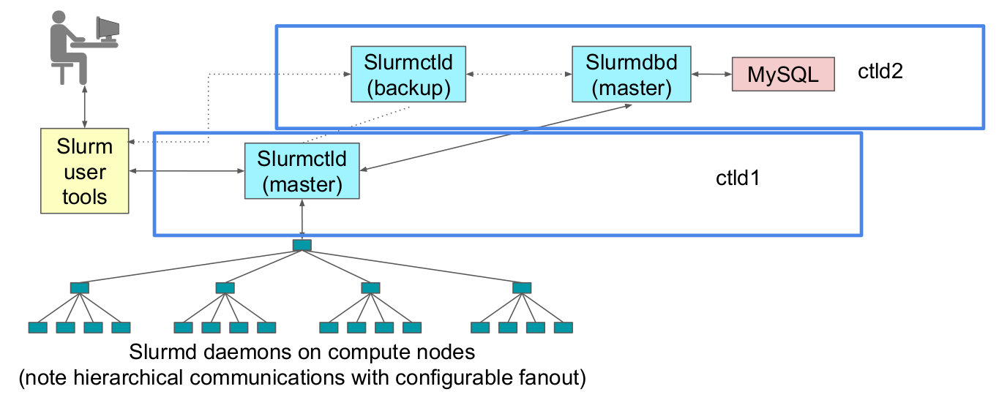

# What is OpenHPC

OpenHPC is a collaborative, community effort that initiated from a
desire to aggregate a number of common ingredients required to deploy
and manage High Performance Computing (HPC) Linux clusters including
provisioning tools, resource management, I/O clients, development
tools, and a variety of scientific libraries.

---

## So, what is it, actually?

### A: Cluster-in-a-box

- Provisioning: dhcp, tftp etc. to install nodes.
  - Warewulf or xCat.
- Bunch of useful HPC software: slurm, munge, various libraries.
- Builds on top of normal Linux distro (CentOS or SLES)

---

## Why change current FGCI praxis?

- CSC now has much less resources to spend on FGCI than before.
- OpenHPC allows to leverage the work of others in the HPC space.
- Scalability limits with current FGCI system
  - Image based installation scales better

---

# OpenHPC and FGCI

- OHPC Slurm in use at many sites
- Node provisioning in production use at Aalto
  - Required (surprisingly) few changes to FGCI ansible code
  - Three new roles
  - Three new playbooks

---

## New OHPC roles

- ansible-role-ohpc-repo
  - Setup OpenHPC yum repository
  - Already upstream in fgci-ansible
- ansible-role-ohpc-setup
  - Setup warewulf and initialise node images
- ansible-role-ohpc-provision
  - Finalize node images and provision them
    - Create nodes (name, MAC etc.)
    - Specify boot kernel and image for nodes
    - Update dhcp/tftp

---

## New OHPC playbooks (1/2)

- admin_ohpc.yml
  - Setup OHPC admin node
  - Mostly generic FGCI node setup stuff + ansible-role-ohpc-setup
    role
- compute-ohpc.yml
  - Mostly same as compute.yml but instead of looping over physical
    running machines, configure OHPC compute node images
    - Bunch of ansible fixes

---

## New OHPC playbooks (2/2)

- admin_ohpc_provision.yml
  - Runs ansible-role-ohpc-provision role
  - Bit slow with lots of nodes
    - If you know what you're doing you can use the relevant warewulf commands directly.

---

## Demo

- How does it all hang together
- hosts file
  - filesystem etc.

---

# Future

- Leverage OpenHPC more
  - But, spack is somewhat self-contained, is using OpenHPC libs
    etc. useful?
- Deprecate old FGCI dhcp/tftp/etc. code
- Combine with CentOS 8 upgrade?

---

- FGCI admin node: ctld2
- FGCI install node: ctld1, (OpenHPC master?)

